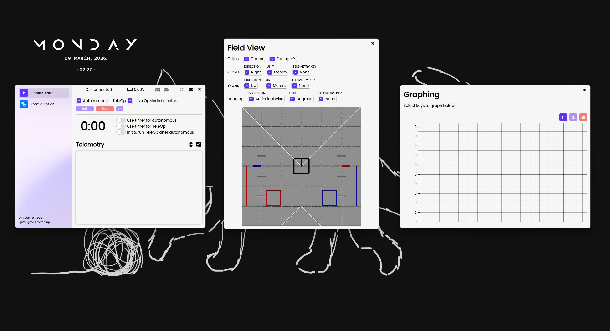

# FTC Driver Station for PC

This is a desktop version of the driver station app used for FIRST Tech Challenge to control a robot.
It can be used without installation of any additional software on the robot, as it uses the same protocol as the mobile driver station app does.

